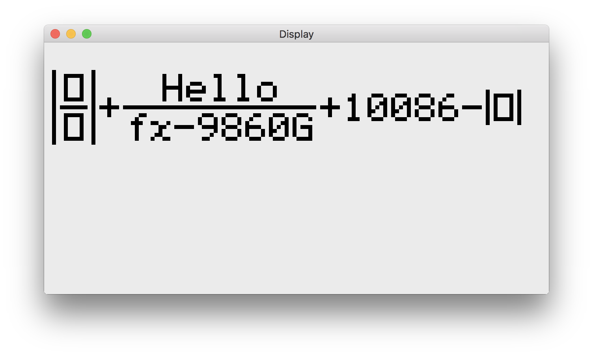
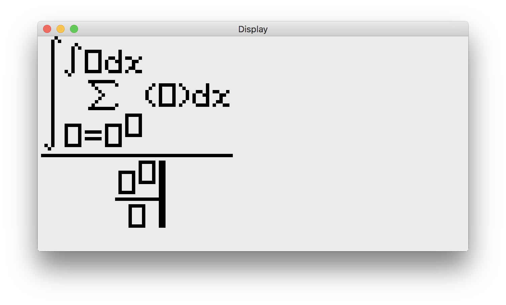

# Console-fx
<big> Math I/O engine tailored for monochrome-screen devices. </big>

## General

### Description
Console-fx is a project aimed to make it possible to display mathematical formulas on monochrome screens beautifully. The
project is written in pure C++ without using any other non-standard libs, and is designed to be built on multi-platforms.

### Usage
The engine is designed as a lib. You need to include it in you own programs, and note that you have to implement some
platform-specific functions like displaying the contents in the VRAM to screen and detecting a key event. A simple test
is provided in main.cpp, which is using GLFW for graphics.

More detailed, a program using the engine should be like this:
```
// File main.cpp placed in the same directory as the folder "Console".

// First you have to include standard library headers and the engine header. Generally only "console.h" is needed.
#include <iostream>
#include "Console/Headers/console.h"

// Also the header where graphics and key-processing fuction implementations are placed for the platform you use.
#include "platform.h"

// Main enterance for the program.
int main(int argc, char *argv[])
{
    // Emulated VRAM.
    unsigned char vram[VRAM_SIZE_BYTE];

    // New instance for class Console and a string as the input/output buffer.
    // Note that all classes, enums, etc., are under the namespace fx.
    fx::Console console(vram);
    fx::String buffer;
    
    // Function "ShouldExit()" need to be implemented by yourself.
    while (!ShouldExit())
    {
        console.input(buffer);                      // Get input, and store it in buffer.
        std::cout << buffer.c_str() << std::endl;   // Process the input. Here we just print it out.
        console.output(buffer);                     // Output the processed string.
    }
    
    return 0;
}

```

For even more information, the source code is always there. :-)

### Shots
There are some screen shots when I run it on my Mac.

Simple expressions goes well.


... and also no problem with complex ones as follows.


## About

### License
The program is released under LGPL v3. Include this message in your program if you want to copy any part into your project.

### Contact
Email: mango@live.cn

Feel free to ask me any questions or propose any suggestions.

